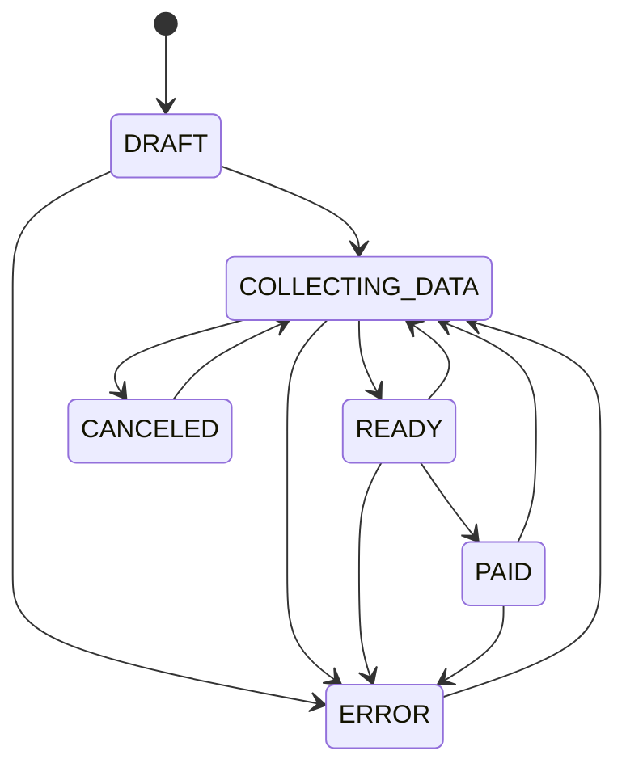

# Cykl życia zobowiązania

Ten dokument jest źródłem prawdy dla `Obligation.lifecycle`. Zmiany stanu
wykonują use case'y; zwykły `PATCH` nigdy nie przyjmuje pola `lifecycle`.

## Stany

| Stan | Znaczenie | Edycja przez `PATCH` |
| --- | --- | --- |
| `DRAFT` | Zobowiązanie utworzone dla przyszłego okresu; dane nie są jeszcze zbierane. | Tak |
| `COLLECTING_DATA` | Dane są zbierane lub korygowane. | Tak |
| `READY` | Kwota i termin są potwierdzone, gotowe do zapłaty. | Nie |
| `PAID` | Zobowiązanie zostało oznaczone jako opłacone. | Nie |
| `CANCELED` | Zobowiązanie anulowane; może zostać ponownie otwarte. | Nie |
| `ERROR` | Problem wykryty przez integrację lub proces automatyczny. | Nie |

## Dozwolone przejścia

Pełna lista:

| Z | Do | Mechanizm | Status |
| --- | --- | --- | --- |
| `DRAFT` | `COLLECTING_DATA` | `update_manual_obligation` po faktycznej ręcznej zmianie danych | zaimplementowane |
| `DRAFT` | `ERROR` | wewnętrzny use case integracji | planowane |
| `COLLECTING_DATA` | `READY` | `mark_obligation_ready` | zaimplementowane |
| `COLLECTING_DATA` | `CANCELED` | `cancel_obligation` | zaimplementowane |
| `COLLECTING_DATA` | `ERROR` | wewnętrzny use case integracji | planowane |
| `READY` | `PAID` | `mark_obligation_paid` | zaimplementowane |
| `READY` | `COLLECTING_DATA` | `reopen_obligation` | zaimplementowane |
| `READY` | `ERROR` | wewnętrzny use case integracji | planowane |
| `PAID` | `COLLECTING_DATA` | `reopen_obligation` | zaimplementowane |
| `PAID` | `ERROR` | wewnętrzny use case integracji | planowane |
| `CANCELED` | `COLLECTING_DATA` | `reopen_obligation` | zaimplementowane |
| `ERROR` | `COLLECTING_DATA` | `reopen_obligation` | zaimplementowane |

Nie ma innych przejść. W szczególności `READY`, `PAID`, `CANCELED` i `ERROR`
nie są edytowalne przez zwykły `PATCH`.

## Use case'y i skutki zmian

| Use case | Dozwolony stan wejściowy | Wynik | Zmieniane pola |
| --- | --- | --- | --- |
| `ensure_obligations_for_period` | — (tworzenie) | bieżący okres: `COLLECTING_DATA`; następny: `DRAFT` | tworzy rekord i ustawia wartości inicjalne; nie zmienia istniejącego rekordu |
| `create_manual_obligation` | — (tworzenie) | `COLLECTING_DATA` albo `READY`, gdy `data_ready=true` | `lifecycle`, ręcznie podane wartości i ich `*_state`/`*_source`, `effective_value_source`, `notes` |
| `update_manual_obligation` | `DRAFT`, `COLLECTING_DATA` | po zmianie `DRAFT → COLLECTING_DATA`; w drugim stanie pozostaje `COLLECTING_DATA` | ręcznie podane wartości, ich `*_state`/`*_source`, `effective_value_source`, `notes`; przy faktycznej zmianie również `lifecycle` |
| `mark_obligation_ready` | `COLLECTING_DATA` | `READY` | `lifecycle`, `amount_state=CONFIRMED`, `due_date_state=CONFIRMED` |
| `mark_obligation_paid` | `READY`; powtórzenie dla `PAID` jest idempotentne | `PAID` | przy pierwszym wywołaniu `lifecycle`, `paid_at=now(UTC)` |
| `reopen_obligation` | `READY`, `PAID`, `CANCELED`, `ERROR` | `COLLECTING_DATA` | `lifecycle`, `paid_at=None`; nie zmienia kwoty, dat, ich stanów ani źródeł |
| `cancel_obligation` | `COLLECTING_DATA` | `CANCELED` | `lifecycle` |
| use case błędu integracji | `DRAFT`, `COLLECTING_DATA`, `READY`, `PAID` | `ERROR` | planowane; zanim powstanie, trzeba zdefiniować pola diagnostyczne, np. kod, komunikat i czas błędu |

`*_state` oznacza `amount_state`, `issue_date_state` lub `due_date_state`, a
`*_source` — odpowiadające im źródło wartości. Ręczna edycja ustawia źródło na
`MANUAL`; stan przechodzi zgodnie z regułami use case'u między `UNKNOWN`,
`ESTIMATED` i `OVERRIDDEN`.

## Endpointy HTTP

Wszystkie aktualne akcje wymagają roli `EDITOR` albo `OWNER` ledgera.

| Endpoint | Use case | Uwagi |
| --- | --- | --- |
| `PATCH /api/v1/ledgers/{ledger_id}/obligations/{obligation_key}` | `update_manual_obligation` | tylko `DRAFT` i `COLLECTING_DATA` |
| `PATCH /api/v1/ledgers/{ledger_id}/obligations/{obligation_key}/ready` | `mark_obligation_ready` | wymaga co najmniej szacowanej kwoty i terminu |
| `POST /api/v1/ledgers/{ledger_id}/obligations/{obligation_key}/mark-paid` | `mark_obligation_paid` | idempotentny dla `PAID` |
| `POST /api/v1/ledgers/{ledger_id}/obligations/{obligation_key}/cancel` | `cancel_obligation` | tylko `COLLECTING_DATA` |
| `POST /api/v1/ledgers/{ledger_id}/obligations/{obligation_key}/reopen` | `reopen_obligation` | otwiera `READY`, `PAID`, `CANCELED` lub `ERROR` |

Przejścia do `ERROR` nie powinny być wystawiane jako zwykła akcja HTTP — będą wykonywane przez
przyszłe use case'y integracyjne bez zależności od routera.
